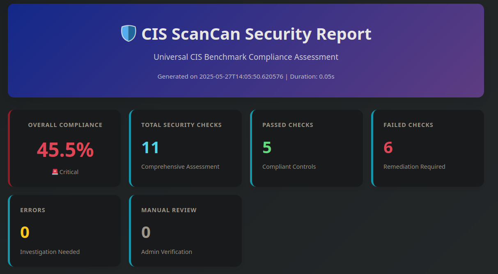
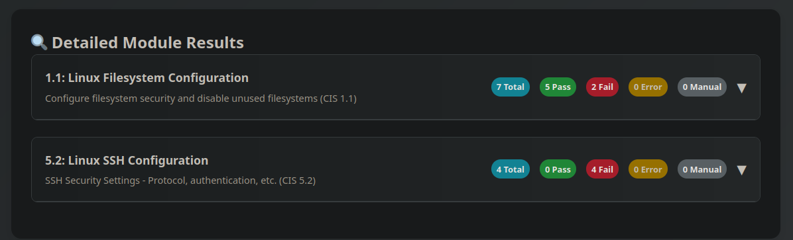
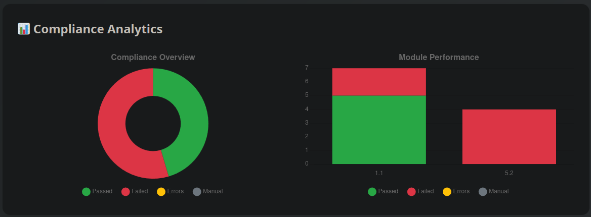

# 🛡️ Universal CIS Scanner (CIS ScanCan)

[](https://opensource.org/licenses/MIT)
[](https://www.python.org/downloads/)
[](https://github.com/yourusername/cis-scanner)
[](https://www.cisecurity.org/cis-benchmarks/)
[](https://github.com/yourusername/cis-scanner)

> **Universal CIS Benchmark Compliance Scanner** - A comprehensive security compliance checker supporting Windows, Linux, macOS, and Unix systems with dynamic module selection, interactive HTML dashboards, and professional reporting.

```
  ██████╗██╗███████╗    ███████╗ ██████╗ ██████╗ ███╗   ██╗ ██████╗ ██████╗ ███╗   ██╗
 ██╔════╝██║██╔════╝    ██╔════╝██╔════╝██╔══██╗████╗  ██║██╔════╝██╔══██╗████╗  ██║
 ██║     ██║███████╗    ███████╗██║     ███████║██╔██╗ ██║██║     ███████║██╔██╗ ██║
 ██║     ██║╚════██║    ╚════██║██║     ██╔══██║██║╚██╗██║██║     ██╔══██║██║╚██╗██║
 ╚██████╗██║███████║    ███████║╚██████╗██║  ██║██║ ╚████║╚██████╗██║  ██║██║ ╚████║
  ╚═════╝╚═╝╚══════╝    ╚══════╝ ╚═════╝╚═╝  ╚═╝╚═╝  ╚═══╝ ╚═════╝╚═╝  ╚═╝╚═╝  ╚═══╝
```

## 🌟 Features

### 🔒 **Comprehensive Security Assessment**
- **600+ Security Checks** across all major operating systems
- **Official CIS Benchmark Alignment** with regular updates
- **Cross-Platform Support** for Windows, Linux, macOS, and Unix systems
- **Dynamic Module Selection** - Choose specific security domains to assess

### 📊 **Professional Reporting & Visualization**
- **Interactive HTML Dashboards** with Chart.js visualizations
- **Compliance Analytics** with pie charts and bar graphs
- **Multiple Report Formats** (HTML, JSON, TXT)
- **Mobile-Responsive Design** for viewing on any device
- **Print-Ready Reports** for documentation and compliance

### 🎯 **Smart Detection & Analysis**
- **Automatic OS Detection** with distribution identification
- **Intelligent Module Loading** based on system compatibility
- **Real-Time Compliance Scoring** with visual indicators
- **Detailed Remediation Guidance** with actionable recommendations

### 🚀 **Enterprise-Ready**
- **Privilege Detection** (Administrator/Root checking)
- **Configuration Management** with file-based settings
- **Comprehensive Error Handling** with detailed logging
- **Automation Support** for CI/CD pipelines
- **Scalable Architecture** for large-scale deployments

## 📸 Screenshots

### HTML Dashboard Overview

*Interactive HTML report with compliance analytics and visual charts*

### Module Details View

*Expandable module sections with detailed security check results*

### Compliance Analytics

*Professional charts showing compliance trends and module performance*

## 📋 Supported Operating Systems

| OS Category | Distributions/Versions | CIS Benchmarks Covered |
|-------------|------------------------|------------------------|
| **🪟 Windows** | Windows 10/11, Server 2016/2019/2022 | Password Policy, Firewall, Registry Settings |
| **🐧 Linux** | Ubuntu, CentOS, RHEL, Debian, Fedora | Filesystem, SSH, Network, Auditing |
| **🍎 macOS** | macOS 10.15+, Big Sur, Monterey, Ventura | Software Updates, Firewall, System Preferences |
| **🖥️ Unix** | AIX, Solaris, HP-UX | Filesystem, Network Security, Services |

## 🚀 Quick Start

### Installation

```bash
# Clone the repository
https://github.com/nightstalker117/CIS_ScanCan.git
cd CIS_ScanCan

# Make executable (Linux/macOS/Unix)
chmod +x cisScanCan.py

# Run with Python (All platforms)
python cisScanCan.py --help
```

### Basic Usage

```bash
# Quick security assessment (recommended modules)
python cisScanCan.py --recommended --format txt

# List available modules for your OS
python cisScanCan.py --list

# Interactive module selection
python cisScanCan.py --interactive

# Comprehensive scan with JSON report
python cisScanCan.py --all --output security_report.json

# Specific modules
python cisScanCan.py --modules "1.1,9.1" --format txt
```

## 📖 Usage Examples

### 🔍 **Discovery & Assessment**

```bash
# Discover available security modules
python cisScanCan.py --list

# Quick 5-minute security assessment with HTML dashboard
python cisScanCan.py --recommended --timeout 300 --format html --output quick_assessment.html

# Full comprehensive security audit with interactive report
python cisScanCan.py --all --verbose --format html --output full_audit.html

# Generate multiple report formats simultaneously
python cisScanCan.py --recommended --format json --output report.json
python cisScanCan.py --recommended --format html --output report.html
python cisScanCan.py --recommended --format txt --output report.txt
```

### 📊 **Interactive HTML Reports**

```bash
# Professional HTML dashboard with charts
python cisScanCan.py --all --format html --output compliance_dashboard.html

# Quick executive summary report
python cisScanCan.py --recommended --format html --output executive_summary.html

# Module-specific detailed analysis
python cisScanCan.py --modules "1.1,5.2,9.1" --format html --output security_focus.html

# Mobile-responsive report for field teams
python cisScanCan.py --recommended --format html --output mobile_report.html
```

### 🎛️ **Advanced Configuration**

```bash
# Use custom module configuration with HTML output
python cisScanCan.py --config custom_modules.ini --format html --output custom_report.html

# Enterprise deployment with comprehensive logging and HTML dashboard
python cisScanCan.py --all --verbose --format html --output "compliance_$(date +%Y%m%d).html"

# Focus on specific security domains with visual analysis
python cisScanCan.py --modules "1.1,3.1,5.2,9.1" --format html --output domain_analysis.html
```

### 🔧 **Integration Examples**

```bash
# CI/CD Pipeline Integration with HTML reports
python cisScanCan.py --recommended --format json | jq '.scan_summary.compliance_percentage'
python cisScanCan.py --recommended --format html --output "ci_report_${BUILD_NUMBER}.html"

# Scheduled Compliance Monitoring with dashboards
python cisScanCan.py --all --format html --output "reports/compliance_$(hostname)_$(date +%Y%m%d).html"
python cisScanCan.py --all --format json --output "reports/compliance_$(hostname)_$(date +%Y%m%d).json"

# Multi-system Assessment with HTML summaries
for server in $(cat servers.txt); do
    ssh $server "python cisScanCan.py --recommended --format html" > "${server}_compliance.html"
    ssh $server "python cisScanCan.py --recommended --format txt" > "${server}_compliance.txt"
done

# Executive Dashboard Generation
python cisScanCan.py --recommended --format html --output "executive_dashboard_$(date +%Y%m%d).html"

# Security Team Daily Reports
python cisScanCan.py --modules "1.1,5.2,9.1" --format html --output "daily_security_$(date +%Y%m%d).html"
```

## 📊 Report Formats

### 🌐 **HTML Reports**
- **Interactive Dashboards** with Chart.js visualizations
- **Compliance Analytics** with pie charts and bar graphs  
- **Responsive Design** that works on desktop and mobile
- **Expandable Sections** for detailed drill-down analysis
- **Professional Styling** suitable for executive presentations
- **Print-Ready Layout** for documentation and audits

### 📄 **JSON Reports**
- **Machine-Readable** format for automation and integration
- **Complete Data Structure** with all scan results and metadata
- **API-Friendly** for consumption by other security tools
- **Structured Output** perfect for data analysis and trending

### 📝 **Text Reports**
- **Human-Readable** format for command-line viewing
- **Concise Summaries** with actionable recommendations
- **Console-Friendly** output for SSH sessions and terminals
- **Log-Suitable** format for syslog integration

## 📊 Sample Output

### Command Line Summary
```
🖥️  Detected Operating System: Linux (Ubuntu 22.04)
🏗️  Architecture: x86_64
🏠  Hostname: security-server-01

🚀 Running Universal CIS compliance scan...

======================================================================
📊 UNIVERSAL CIS SCAN SUMMARY
======================================================================
Operating System: Linux (Ubuntu 22.04)
Overall Compliance: 87.5%
Total Checks: 48
Passed: 42
Failed: 4
Errors: 1
Manual Review Required: 1
Execution Time: 12.34 seconds

🎯 RECOMMENDATIONS
======================================================================
✅ Good compliance! Consider addressing the remaining issues for optimal security.
• 4 security configurations failed compliance checks
• Review failed checks and implement recommended security settings
• 1 checks require manual verification
```

### HTML Dashboard Features
The interactive HTML reports include:

- **📊 Compliance Overview Chart**: Visual pie chart showing pass/fail ratios
- **📈 Module Performance Graphs**: Bar charts comparing security modules  
- **🎯 Interactive Elements**: Expandable sections and hover effects
- **📱 Mobile Responsive**: Perfect viewing on any device
- **🖨️ Print-Ready**: Professional layout for documentation
- **⚡ Real-Time Data**: Dynamic loading with smooth animations

### JSON Output Structure
```json
{
  "scan_summary": {
    "compliance_percentage": 87.5,
    "total_checks": 48,
    "passed_checks": 42,
    "failed_checks": 4,
    "os_info": {
      "system": "linux",
      "distribution": "ubuntu",
      "version": "22.04"
    }
  },
  "detailed_results": {
    "1.1": {
      "1.1.1_cramfs_disabled": {
        "status": "PASS",
        "description": "Ensure cramfs filesystem is disabled",
        "reason": "Module not loaded"
      }
    }
  }
}
```

## 🏗️ Architecture

### Module Structure

```
CIS Scanner
├── OS Detection Engine
├── Universal Benchmark Registry
├── Module Manager
│   ├── Windows Modules
│   ├── Linux Modules  
│   ├── macOS Modules
│   └── Unix Modules
├── Security Assessment Engine
├── Report Generator
└── Configuration Manager
```

### Security Modules by OS

#### Windows Modules
- **Password Policy (1.1)**: Complexity, aging, history requirements
- **Windows Firewall (9.1)**: All profiles (Domain, Private, Public)
- **Registry Security**: Critical security settings validation

#### Linux Modules  
- **Filesystem Security (1.1)**: Partition security, unused filesystems
- **SSH Configuration (5.2)**: Secure SSH settings and authentication
- **Network Parameters (3.1)**: IP forwarding, redirects, security settings
- **System Auditing (4.1)**: auditd configuration and log management

#### macOS Modules
- **Software Updates (1.1)**: Automatic updates and patch management
- **Application Firewall (4.1)**: Firewall and stealth mode configuration
- **System Security**: Password policies and login security

#### Unix Modules
- **Filesystem Security (1.1)**: Partition security and permissions
- **Network Security (3.1)**: Service hardening and network parameters

## ⚙️ Configuration

### Module Configuration File

Create a `modules.ini` file for custom module selection:

```ini
[modules]
selected = 1.1,3.1,5.2,9.1

[metadata]
created = 2024-01-15T10:30:00
description = Custom security assessment for web servers
```

### Environment Variables

```bash
# Set custom timeout (seconds)
export CIS_SCANNER_TIMEOUT=120

# Enable debug logging
export CIS_SCANNER_DEBUG=1

# Custom report directory
export CIS_SCANNER_REPORTS_DIR=/var/log/compliance
```

## 🔐 Security Requirements

### Privileges Required

| Operating System | Required Privileges | Reason |
|------------------|-------------------|---------|
| **Windows** | Administrator | Registry access, security policy reading |
| **Linux** | Root (sudo) | System file access, service status |
| **macOS** | Root (sudo) | System preferences, security settings |
| **Unix** | Root | System configuration files |

### Running Without Privileges

```bash
# Continue with limited functionality
python cisScanCan.py --recommended --force-continue

# Some checks will be marked as MANUAL for review
```

## 📈 Compliance Scoring

| Score Range | Status | Description |
|-------------|--------|-------------|
| **90-100%** | 🏆 Excellent | Follows CIS best practices |
| **80-89%** | ✅ Good | Minor issues to address |
| **60-79%** | ⚠️ Moderate | Several improvements needed |
| **< 60%** | 🚨 Critical | Immediate attention required |

## 🔄 Continuous Integration

### GitHub Actions Example

```yaml
name: Security Compliance Scan
on: [push, pull_request, schedule]

jobs:
  security-scan:
    runs-on: ubuntu-latest
    steps:
      - uses: actions/checkout@v3
      - name: Setup Python
        uses: actions/setup-python@v4
        with:
          python-version: '3.8'
      - name: Run CIS Scanner
        run: |
          python cisScanCan.py --recommended --format json > compliance_report.json
          python cisScanCan.py --recommended --format html > compliance_dashboard.html
      - name: Upload HTML Dashboard
        uses: actions/upload-artifact@v3
        with:
          name: compliance-dashboard
          path: compliance_dashboard.html
      - name: Upload JSON Results
        uses: actions/upload-artifact@v3
        with:
          name: compliance-report
          path: compliance_report.json
      - name: Check Compliance Threshold
        run: |
          COMPLIANCE=$(python cisScanCan.py --recommended --format json | jq -r '.scan_summary.compliance_percentage')
          echo "Compliance: $COMPLIANCE%"
          if (( $(echo "$COMPLIANCE < 85" | bc -l) )); then
            echo "❌ Compliance below threshold: $COMPLIANCE%"
            exit 1
          else
            echo "✅ Compliance meets threshold: $COMPLIANCE%"
          fi
```

### Jenkins Pipeline

```groovy
pipeline {
    agent any
    
    triggers {
        cron('H 2 * * *') // Daily at 2 AM
    }
    
    stages {
        stage('Security Compliance Scan') {
            steps {
                script {
                    // Generate multiple report formats
                    sh """
                        python cisScanCan.py --all --format json --output compliance_${BUILD_NUMBER}.json
                        python cisScanCan.py --all --format html --output compliance_${BUILD_NUMBER}.html
                        python cisScanCan.py --all --format txt --output compliance_${BUILD_NUMBER}.txt
                    """
                    
                    // Archive all report formats
                    archiveArtifacts artifacts: 'compliance_*.json,compliance_*.html,compliance_*.txt'
                    
                    // Check compliance threshold
                    def compliance = sh(
                        script: 'python cisScanCan.py --recommended --format json | jq -r .scan_summary.compliance_percentage',
                        returnStdout: true
                    ).trim()
                    
                    echo "Current compliance level: ${compliance}%"
                    
                    // Set build status based on compliance
                    if (compliance.toFloat() < 70) {
                        currentBuild.result = 'FAILURE'
                        error("❌ Critical compliance failure: ${compliance}% (threshold: 70%)")
                    } else if (compliance.toFloat() < 85) {
                        currentBuild.result = 'UNSTABLE'
                        echo "⚠️ Compliance below recommended level: ${compliance}% (recommended: 85%)"
                    } else {
                        echo "✅ Excellent compliance: ${compliance}%"
                    }
                }
            }
        }
        
        stage('Publish HTML Report') {
            steps {
                publishHTML([
                    allowMissing: false,
                    alwaysLinkToLastBuild: true,
                    keepAll: true,
                    reportDir: '.',
                    reportFiles: "compliance_${BUILD_NUMBER}.html",
                    reportName: 'CIS Compliance Dashboard',
                    reportTitles: 'Security Compliance Report'
                ])
            }
        }
        
        stage('Notify Teams') {
            when {
                anyOf {
                    currentBuild.result == 'FAILURE'
                    currentBuild.result == 'UNSTABLE'
                }
            }
            steps {
                script {
                    def compliance = sh(
                        script: 'python cisScanCan.py --recommended --format json | jq -r .scan_summary.compliance_percentage',
                        returnStdout: true
                    ).trim()
                    
                    // Send Slack notification (example)
                    slackSend(
                        channel: '#security',
                        color: currentBuild.result == 'FAILURE' ? 'danger' : 'warning',
                        message: """
                            🛡️ CIS Compliance Alert
                            
                            Server: ${env.NODE_NAME}
                            Compliance Level: ${compliance}%
                            Status: ${currentBuild.result}
                            
                            📊 Dashboard: ${BUILD_URL}CIS_Compliance_Dashboard/
                            📄 Full Report: ${BUILD_URL}artifact/compliance_${BUILD_NUMBER}.html
                        """
                    )
                }
            }
        }
    }
    
    post {
        always {
            // Clean up workspace but keep reports
            sh 'find . -name "*.log" -delete'
        }
        success {
            echo '✅ Compliance scan completed successfully'
        }
        failure {
            echo '❌ Compliance scan failed - immediate attention required'
        }
    }
}
```

## 🛠️ Development

### Adding New Modules

1. **Create Module Class**:
```python
class CustomSecurityModule(CISModule):
    def get_name(self) -> str:
        return "Custom Security Check"
    
    def get_category_id(self) -> str:
        return "X.X"
    
    def is_applicable(self, os_info: Dict[str, str]) -> bool:
        return os_info.get('category') == 'your_os'
    
    def run_checks(self, scanner) -> Dict[str, Any]:
        # Implementation here
        pass
```

2. **Register Module**:
```python
# Add to module_map in UniversalModuleManager
'your_os': {
    'X.X': CustomSecurityModule,
}
```

### Testing

```bash
# Run specific module tests
python -m pytest tests/test_modules.py

# Test on specific OS
python cisScanCan.py --modules "1.1" --verbose

# Validate all modules
python cisScanCan.py --list --verbose
```

## 📝 Contributing

We welcome contributions! Please see our [Contributing Guidelines](CONTRIBUTING.md).

### Development Setup

```bash
# Fork and clone the repository
git clone https://github.com/nightstalker117/CIS_ScanCan.git
cd CIS_ScanCan

# Create development branch
git checkout -b feature/new-security-module

# Make changes and test
python cisScanCan.py --recommended --verbose

# Submit pull request
```

### Reporting Issues

- **Bug Reports**: Use GitHub Issues with detailed reproduction steps
- **Feature Requests**: Use GitHub Issues with clear use case description

### 🗺️ Roadmap

### Recently Added ✅
- **Interactive HTML Reports** with Chart.js visualizations
- **Mobile-Responsive Dashboards** for field team access
- **Advanced CSS3 Styling** with animations and hover effects  
- **Expandable Module Sections** for detailed drill-down
- **Professional Print Layouts** for compliance documentation

### Upcoming Features 🚧

- [ ] **REST API Interface** for integration with security platforms
- [ ] **Database Integration** for historical trend analysis
- [ ] **Custom Rule Engine** for organization-specific compliance checks
- [ ] **Email Report Distribution** with scheduled delivery
- [ ] **Multi-Language Support** for international deployments
- [ ] **Cloud Platform Support** (AWS, Azure, GCP security assessments)
- [ ] **Container Security** scanning (Docker, Kubernetes CIS benchmarks)
- [ ] **Network Device Support** (Cisco, Juniper, Palo Alto)
- [ ] **Mobile Device Management** integration (MDM compliance)
- [ ] **Advanced Analytics** with machine learning insights

### Long-Term Vision 🔮
- [ ] **SaaS Platform** with centralized compliance management
- [ ] **AI-Powered Recommendations** based on threat intelligence
- [ ] **Compliance Automation** with auto-remediation capabilities
- [ ] **Integration Marketplace** with third-party security tools

### Version History

- **v2.0.0** - ✅ Interactive HTML reports with Chart.js integration
- **v1.2.0** - Enhanced reporting and configuration management  
- **v1.1.0** - Added macOS and Unix support
- **v1.0.0** - Initial release with core OS support

## 📜 License

This project is licensed under the MIT License - see the [LICENSE](LICENSE) file for details.

## 🙏 Acknowledgments

- **Center for Internet Security (CIS)** for the comprehensive benchmark standards
- **Security Community** for feedback and contributions
- **Open Source Contributors** who help improve the project

## 📞 Support

- **Documentation**: [Wiki](https://github.com/nightstalker117/CIS_ScanCan/wiki)
- **Community**: [Discussions](https://github.com/nightstalker117/CIS_ScanCan/discussions)
- **Issues**: [GitHub Issues](https://github.com/nightstalker117/CIS_ScanCan/issues)

---

**⭐ If this project helps you improve your security posture, please give it a star!**

Made with ❤️
